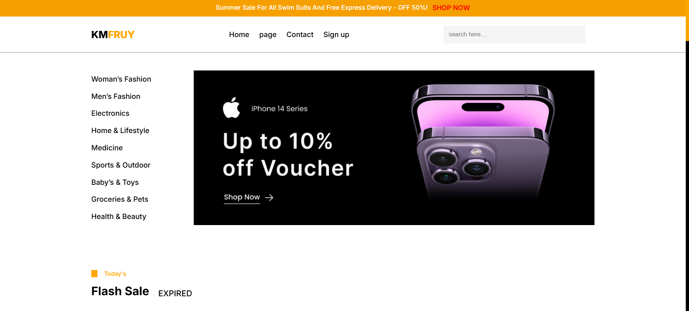
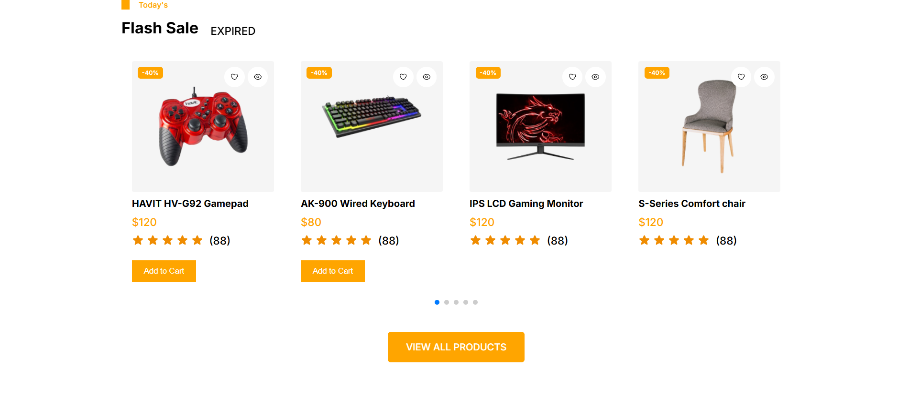
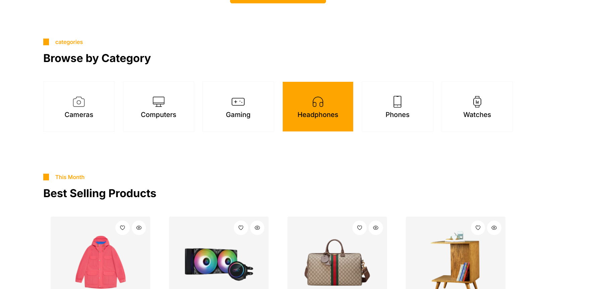

# 🛍️ KMFRUY - E-commerce Website

A modern and responsive e-commerce frontend built for a freelance project.  
The website provides a clean UI for browsing products, searching, and managing a shopping cart.

---

## 🚀 Features

- 🧭 Responsive Navigation Bar
- 🔍 Product Search UI
- ❤️ Wishlist Icon
- 🛒 Shopping Cart Page
- 🎯 Clean and Modern UI Design
- ⚡ Smooth Animations (ScrollReveal)
- 📱 Fully Responsive Design

---

## 📸 Preview

---

## 🛠️ Tech Stack

- HTML5
- CSS3
- JavaScript (Vanilla)
- ScrollReveal.js
- Swiper.js

---

## 📂 Project Structure
KMFRUY/
│── index.html
│── sign-up.html
│── cart.html
│
├── css/
│   └── style.css
│
├── js/
│   └── script.js
│
├── image/
│   └── (assets & icons)
│
└── images/
    └── preview.png
